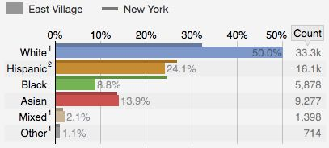

# Neighborhood Outline
[GeoJSON](https://github.com/jgadasi/HC6/blob/master/map.geojson)

# Basic Demographics and Statistics
## Zip Codes
10003, 10009
## Census Tract Codes 
0042.00, 0040.00, 0034.00, 0028.00, 0024.00, 0038.00, 0032.00, 0026.02,0026.01, 0036.02, 0030.02, 0022.02, 0020.00
## Map of Neighborhood

## Picture of Neighborhood

## Neighborhood Demographics

### Distance to Federal Hall
2.4 miles

### Distance to Empire State Building
1.9 miles 

# Turnstile Entries 
## Station
1st Avenue L-Train 
## Turnstile
01-00-00
## Entries, Exits, and Entries/Exits

